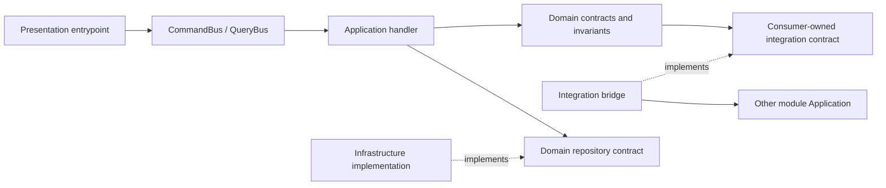

# Module Scaffold Guide

Use this checklist when adding a new reusable module to the skeleton or to a project generated from it.
Keep the module small, neutral and layered; move project-specific business rules to the concrete project.

## Fast checklist

1. **Pick the module boundary**
   - Shared module: `src/Module/{ModuleName}`.
   - Web-only module: `apps/web/src/Module/{ModuleName}`.
   - Console-only module: `apps/console/src/Module/{ModuleName}`.
   - Do not mix unrelated subdomains in one module.
2. **Create the module class**
   - Implement `ModuleInterface`.
   - Return `__DIR__` from `getModuleDir()`.
   - Return `$this->getModuleDir() . '/Resource/config'` from `getModuleConfigPath()`.
3. **Register the module**
   - Shared: `config/modules.php`.
   - Web: `apps/web/config/modules.php`.
   - Console: `apps/console/config/modules.php`.
   - Use explicit environment flags, for example `['all' => true]`.
4. **Add `Resource/config/services.yaml`**
   - Register only the module namespace.
   - Exclude DTOs, entities, enums, value objects, resources and the module class.
   - Add aliases from Domain interfaces to Infrastructure or Integration implementations explicitly.
5. **Keep layer responsibilities strict**
   - Presentation calls Application through the command/query bus only.
   - Application orchestrates use cases and returns DTOs.
   - Domain owns invariants and contracts.
   - Infrastructure implements local technical details.
   - Integration handles external or cross-module communication.
6. **Add repository primitives only where needed**
   - Criteria contracts live in Domain.
   - Sort fields must be whitelisted before applying them to Doctrine or any query builder.
   - Pagination must fail fast on invalid limit/offset.
7. **Add Presentation security only for web entrypoints**
   - Put route/action/permission/grant/rule/voter code in the web app module.
   - Keep permission decisions out of controllers.
   - Do not add production login, registration, default users, passwords or RBAC by default.
8. **Bridge modules through consumer-owned contracts**
   - The consuming module owns the interface under `Domain/Service/Integration`.
   - The implementation lives in the consuming module's `Integration` layer.
   - The implementation calls another module's Application query/DTO, not its Domain model.
9. **Validate**
   - Add unit tests for Domain/Application logic.
   - Add integration tests for wiring, routes, console commands or persistence behavior.
   - Run `make check` before reporting completion or opening/readying a PR.

## Reference map

Start from these working examples before adding new code:

- Minimal read-only Query flow: [`docs/diagnostics-query-flow.md`](diagnostics-query-flow.md).
- Neutral DDD/CQRS User module: [`docs/user-module-example.md`](user-module-example.md).
- Module extension interfaces under `src/Component/ModuleSystem/Extension/*`:
  [`DoctrineInterface`](../src/Component/ModuleSystem/Extension/DoctrineInterface.php),
  [`TwigInterface`](../src/Component/ModuleSystem/Extension/TwigInterface.php),
  [`TranslationInterface`](../src/Component/ModuleSystem/Extension/TranslationInterface.php).
  The web [`UserModule`](../apps/web/src/Module/User/UserModule.php) is the minimal `TwigInterface` example
  with namespace `web.user` and templates under `Resource/templates`; it also shows `TranslationInterface`
  with translations under `Resource/translations`.
- Repository criteria, pagination and sort primitives under `src/Component/Repository/*`:
  [`CriteriaWithLimitInterface`](../src/Component/Repository/CriteriaWithLimitInterface.php),
  [`CriteriaWithOffsetInterface`](../src/Component/Repository/CriteriaWithOffsetInterface.php),
  [`SortableCriteriaInterface`](../src/Component/Repository/SortableCriteriaInterface.php),
  [`SortEnum`](../src/Component/Repository/Enum/SortEnum.php),
  [`CriteriaWithLimitTrait`](../src/Component/Repository/Trait/CriteriaWithLimitTrait.php),
  [`CriteriaWithOffsetTrait`](../src/Component/Repository/Trait/CriteriaWithOffsetTrait.php),
  [`SortableCriteriaTrait`](../src/Component/Repository/Trait/SortableCriteriaTrait.php),
  [`LimitOffsetSortCriteriaMapper`](../src/Component/Repository/Criteria/Mapper/LimitOffsetSortCriteriaMapper.php).
- Web Presentation security pattern under `apps/web/src/Module/User/Security/UserProfile/*`:
  [`ActionEnum`](../apps/web/src/Module/User/Security/UserProfile/ActionEnum.php),
  [`PermissionEnum`](../apps/web/src/Module/User/Security/UserProfile/PermissionEnum.php),
  [`Rule`](../apps/web/src/Module/User/Security/UserProfile/Rule.php),
  [`Voter`](../apps/web/src/Module/User/Security/UserProfile/Voter.php),
  [`Grant`](../apps/web/src/Module/User/Security/UserProfile/Grant.php).
- User integration bridge classes:
  [`GetRuntimeDiagnosticsSnapshotServiceInterface`](../src/Module/User/Domain/Service/Integration/RuntimeDiagnostics/GetRuntimeDiagnosticsSnapshotServiceInterface.php),
  [`RuntimeDiagnosticsSnapshotDto`](../src/Module/User/Domain/Dto/RuntimeDiagnosticsSnapshotDto.php),
  [`QueryBusGetRuntimeDiagnosticsSnapshotService`](../src/Module/User/Integration/Service/Diagnostics/QueryBusGetRuntimeDiagnosticsSnapshotService.php),
  [`GetRuntimeDiagnosticsQuery`](../src/Module/Diagnostics/Application/UseCase/Query/GetRuntimeDiagnostics/GetRuntimeDiagnosticsQuery.php),
  [`RuntimeDiagnosticsDto`](../src/Module/Diagnostics/Application/Dto/RuntimeDiagnosticsDto.php).

## Directory layout

```text
src/Module/Example/
├── Application/
│   ├── Dto/
│   └── UseCase/
│       ├── Command/
│       └── Query/
├── Domain/
│   ├── Entity/
│   ├── Enum/
│   ├── Repository/
│   ├── Service/
│   │   └── Integration/
│   └── ValueObject/
├── Infrastructure/
│   ├── Repository/
│   └── Service/
├── Integration/
│   └── Service/
├── Resource/
│   ├── config/
│   ├── templates/
│   └── translations/
└── ExampleModule.php
```

For app-specific Presentation code, use the app module path:

```text
apps/web/src/Module/Example/
├── Controller/
├── Route/
├── Security/
├── Resource/config/
└── ExampleModule.php
```

## Layer responsibilities and forbidden shortcuts

| Layer | Put here | Do not put here |
| --- | --- | --- |
| Presentation | Controllers, console commands, routes, voters, grant helpers, request/response formatting | Business rules, repository calls, direct Infrastructure calls |
| Application | Commands, queries, handlers, use-case DTOs, orchestration | Domain invariants, SQL/HTTP/filesystem details, cross-module Domain object usage |
| Domain | Entities, value objects, domain services, repository interfaces, consumer-owned integration contracts | Symfony services, Doctrine query builders, external API clients, other module Domain models |
| Infrastructure | Repository implementations, local persistence, cache/filesystem implementations | Business decisions, Presentation authorization rules |
| Integration | External API clients, listeners, cross-module bridge implementations | Domain model sharing across modules, hidden fallbacks, project-specific production operations |

Forbidden shortcuts:

- Do not call repositories or Infrastructure services from controllers or console commands.
- Do not import another module's Domain model into your Domain/Application use case.
- Do not add `Port` or `Adapter` to class names, namespaces or directories.
- Do not add default production users, passwords, secrets, real external calls or database writes to skeleton examples.
- Do not add guessed defaults for required data; validate and fail fast.

## Resource path contract

Every module has a `Resource/config` directory loaded by [`ModuleKernelTrait`](../src/Component/ModuleSystem/ModuleKernelTrait.php) through the module class.
Use the extension interfaces only when the module owns that resource type:

- Doctrine entities: implement [`DoctrineInterface`](../src/Component/ModuleSystem/Extension/DoctrineInterface.php), return the entity namespace and mapping path, and keep mapping explicit. Do not use global `auto_mapping: true` as the module contract.
- Twig templates: implement [`TwigInterface`](../src/Component/ModuleSystem/Extension/TwigInterface.php), declare a base templates path and an explicit Twig namespace.
- Translations: implement [`TranslationInterface`](../src/Component/ModuleSystem/Extension/TranslationInterface.php), declare base and additional translation directories.

Keep service aliases explicit in `Resource/config/services.yaml`:

```yaml
Skeleton\Common\Module\Example\Domain\Repository\ExampleRepositoryInterface:
  alias: Skeleton\Common\Module\Example\Infrastructure\Repository\ExampleRepository
```

## Query and repository checklist

Use [`docs/diagnostics-query-flow.md`](diagnostics-query-flow.md) for the smallest read-only flow and
[`docs/user-module-example.md`](user-module-example.md) for repository-backed DDD/CQRS shape.

When a module exposes a list query:

1. Define a Query object and QueryHandler in Application.
2. Return Application DTOs only.
3. Define repository criteria and repository interface in Domain.
4. Put persistence implementation in Infrastructure.
5. Use `CriteriaWithLimitInterface`, `CriteriaWithOffsetInterface` and `SortableCriteriaInterface` only if the use case needs them.
6. Whitelist sort fields in Infrastructure before passing sort to Doctrine or another query engine.
7. Add a deterministic unique field to project-specific sort when pagination requires stable ordering.
8. Test invalid sort field, invalid limit/offset and empty-result behavior.

## Presentation security checklist

Use the User web module security files as the copy point:

1. Define route constants/generator in `Route`.
2. Define controller action names in `ActionEnum`.
3. Define exposed permission values in `PermissionEnum`.
4. Put decision logic in `Rule`.
5. Delegate Symfony authorization to `Voter`.
6. Use `Grant` only as a Presentation helper for UI visibility.
7. Keep controllers limited to `#[IsGranted]`, bus calls and response mapping.
8. Keep Domain rules separate from Presentation authorization.

## Integration bridge checklist

Use the User → Diagnostics bridge as the copy point:

1. Consumer module owns the contract:
   [`GetRuntimeDiagnosticsSnapshotServiceInterface`](../src/Module/User/Domain/Service/Integration/RuntimeDiagnostics/GetRuntimeDiagnosticsSnapshotServiceInterface.php).
2. Consumer module owns the scalar/value DTO:
   [`RuntimeDiagnosticsSnapshotDto`](../src/Module/User/Domain/Dto/RuntimeDiagnosticsSnapshotDto.php).
3. Consumer module implements the bridge in Integration:
   [`QueryBusGetRuntimeDiagnosticsSnapshotService`](../src/Module/User/Integration/Service/Diagnostics/QueryBusGetRuntimeDiagnosticsSnapshotService.php).
4. Bridge calls provider Application:
   [`GetRuntimeDiagnosticsQuery`](../src/Module/Diagnostics/Application/UseCase/Query/GetRuntimeDiagnostics/GetRuntimeDiagnosticsQuery.php).
5. Bridge maps provider DTO into consumer-owned DTO.
6. Tests must prove dependency direction and fail fast on unexpected bus results.



## Generic skeleton vs project-specific domain

Keep in the skeleton:

- Neutral module layout and registration rules.
- Minimal Diagnostics query flow.
- Neutral UserProfile example with in-memory persistence.
- Generic repository criteria/pagination/sort primitives.
- Presentation security structure without production auth.
- Consumer-owned Integration bridge pattern.

Keep in concrete projects:

- Real business domains and migration plans.
- Production persistence, migrations and data backfills.
- Real external services and credentials.
- Project-specific authorization model and user lifecycle.
- Domain-specific operations such as Portfolio, TInvest, broker or trading workflows.

## Future generator note

A future generator may automate this checklist, for example `make module NAME=Example --dry-run`.
Until then, treat this guide as the source checklist and keep generated code proposals behind review.
