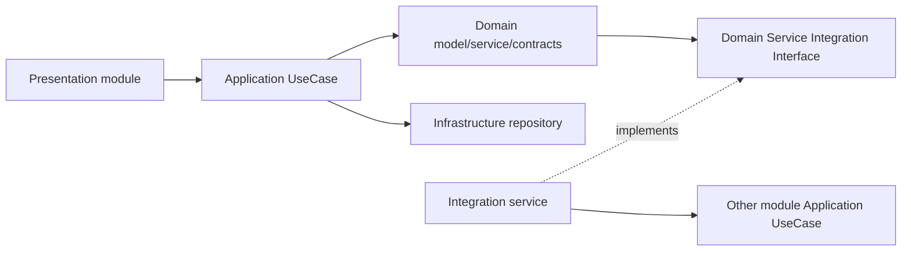

# EPIC-skeleton-module-ddd-scaffold: Каркасные DDD/CQRS паттерны модулей

## 0. Простое описание (Human Brief)
### Проблема простыми словами (Problem)
- `symfony-ddd-ai-skeleton` уже даёт базовый Symfony 8 каркас, но часть полезных повторяемых решений из `stocks2` пока живёт только в конкретном проекте.
- Новым проектам нужны понятные примеры модулей на всех слоях: Presentation, Application, Domain, Infrastructure, Integration.
- В skeleton важно вынести именно каркасные подходы и нейтральный примерный код, а не бизнес-домен `Portfolio`/`TInvest`.

### Варианты или путь решения (Solution Sketch)
- Использовать `Health`/`Diagnostics` как короткий read-only пример query flow.
- Добавить или усилить нейтральный `User` example module для model/repository/security/Auth-like паттернов без production secrets.
- Выделить reusable framework patterns из `stocks2` и адаптировать их в skeleton без бизнес-домена: module extension points, Doctrine/Twig/translations paths, Presentation security pattern, repository criteria, pagination/sorting, module docs/checklists.
- Всё, что специфично для `Portfolio`, `TInvest`, broker API или shared DB, оставить в `stocks2` и не тащить в skeleton.

### Ожидаемый результат (Expected Result)
- При старте нового проекта есть готовый пример, как создавать module со слоями DDD/CQRS, routes/templates/translations, security, repositories, criteria, pagination и integration bridge.
- Skeleton остаётся generic (общим), без инвестиционного/брокерского домена и без production endpoints/secrets.

## 1. Concept and Goal (Концепция и цель)
### Story (Job Story)
> Когда я создаю новый Symfony DDD/CQRS проект из skeleton, я хочу видеть готовые каркасные module patterns и минимальные примеры Health/User, чтобы быстро стартовать без копирования кода из бизнесового проекта.

### Goal (Цель по SMART)
До review эпика добавить в `symfony-ddd-ai-skeleton` набор reusable module scaffold паттернов и нейтральных примеров Health/User: module resource paths, Doctrine/Twig/translations extension points, Presentation security pattern, Application use case examples, Domain model/repository/criteria examples, Infrastructure repository examples, Integration bridge example, pagination/sorting components и документацию, проверяемые через `make check`.

## 2. Context and Scope (Контекст и границы)
*   **In Scope (Что делаем):**
    *   Module-level resource path conventions: `Resource/config`, `Resource/templates`, `Resource/translations`, Doctrine mappings/entities.
    *   Kernel/module extension points для Doctrine, Twig и translations; Doctrine `auto_mapping` не включать по умолчанию.
    *   Presentation module pattern: `Route`, `RoleEnum`, `ActionEnum`, `PermissionEnum`, `Grant`, `Rule`, `Voter`; object-level access — отдельный future slice.
    *   Application pattern: `UseCase/Query/*`, `UseCase/Command/*` при необходимости, handler, DTO, mapper.
    *   Domain pattern: model/entity/value object, repository interfaces, criteria, domain service.
    *   Infrastructure pattern: Doctrine/read repository implementation, criteria mapper.
    *   Integration pattern: consumer-owned `Domain\Service\Integration\*Interface` + `Integration\Service\*` bridge to another module Application query.
    *   Pagination/sorting reusable components and traits, включая whitelist allowed sort fields перед Doctrine criteria.
    *   Documentation and examples showing how to create a new module from scratch.
*   **Out of Scope (Чего НЕ делаем):**
    *   Не переносим `Portfolio`, `TInvest`, broker API, trading, shared DB ownership или investment-specific vocabulary.
    *   Не добавляем реальные production endpoints, secrets, внешние API calls или боевые email/notification.
    *   Не превращаем skeleton в полноценное приложение с бизнесовой логикой.
    *   Не добавляем code generation CLI в этот эпик; можно только завести backlog-задачу на будущий generator.

## 3. Requirements (Требования, MoSCoW)
### 🔴 Must Have (Блокирующие требования)
- [ ] Проведён inventory reusable patterns из `stocks2`: что переносим как framework-level code, что оставляем project-specific domain.
- [ ] Skeleton поддерживает module-local paths для config, Doctrine mappings/entities, Twig templates и translations.
- [ ] Есть нейтральный пример Presentation security pattern: route constants/generator, action, permission, rule, voter, grant.
- [ ] Есть canonical Application query handler example в `UseCase/Query`, покрытый тестами.
- [ ] Есть canonical Domain model/repository/criteria example без бизнес-домена `Portfolio`/`TInvest`.
- [ ] Есть Infrastructure repository example с pagination/sorting criteria и tests.
- [ ] Есть Integration bridge example, показывающий межмодульное взаимодействие через consumer-owned interface, без терминов `Port`/`Adapter`.
- [ ] Pagination/sorting components вынесены как reusable skeleton primitives, sort из request проходит через whitelist allowed fields.
- [ ] Документация описывает, что переносится как каркасный паттерн, а что должно оставаться domain-specific в проекте-потомке.
- [ ] `make check` проходит.

### 🟡 Should Have (Важные требования)
- [ ] Health/Diagnostics пример сохранить максимально маленьким и read-only.
- [ ] User example сделать нейтральным: auth/security/repository patterns без production credentials, default users и domain-specific roles; `/health` не должен зависеть от auth.
- [ ] Добавить Mermaid-схему module flow: Presentation → Application → Domain/Infrastructure → Integration.
- [ ] Добавить checklist “как создать новый module”.
- [ ] Обновить docs/conventions, если фактический skeleton pattern отличается от текущих правил.

### 🟢 Could Have (Желательно)
- [ ] Добавить skeleton tests fixture module или demo module, который можно копировать при старте нового проекта.
- [ ] Добавить optional Phoenix UI preset docs для Twig components, если skeleton оставляет Phoenix как UI baseline.
- [ ] Подготовить backlog-задачу на будущий generator (`make module NAME=...`) с `--dry-run` и no-overwrite, но не реализовывать его в этом эпике.

### ⚫ Won't Have (Не в этот раз)
- [ ] Не переносим брокерские интеграции, portfolio screens, trading controls, market data и shared DB read models.
- [ ] Не делаем миграции под реальные production таблицы.
- [ ] Не вводим generic `BrokerClientInterface`.
- [ ] Не используем термины `Port`/`Adapter` в путях и именах классов.

## 4. Solution Design (Техническое решение)

Предпочтительный подход:

- Каркасные primitives идут в `src/Component`, `src/Application`, `src/Infrastructure`, `apps/web/src/Component`.
- Нейтральные примеры идут в `src/Module/Diagnostics`, `apps/web/src/Module/Diagnostics` и будущем/обновлённом `User` module; `User` — example, не production-auth по умолчанию.
- Примеры должны быть небольшими, тестируемыми и безопасными: без внешних сервисов, secrets и production-specific assumptions.
- Из `stocks2` переносить только generic approach (подход), не class names с бизнесовым смыслом; `Portfolio`, `TInvest`, broker/trading/market-data vocabulary запрещены в runtime skeleton examples.

## 5. Implementation Plan (План реализации)
- [x] [TASK-skeleton-patterns-inventory](done/TASK-skeleton-patterns-inventory.todo.md) — сделать список `берём / не берём` из `stocks2`, отделить framework-level code от business-domain code.
- [x] [TASK-skeleton-module-extension-points](done/TASK-skeleton-module-extension-points.todo.md) — добавить module extension points для Doctrine/Twig/translations, `TwigCompilerPass`, Doctrine mapping registration и docs по путям `Resource/*`.
- [x] [TASK-skeleton-repository-criteria-pagination-sort](done/TASK-skeleton-repository-criteria-pagination-sort.todo.md) — перенести reusable criteria interfaces/traits, sort mapper, pagination DTO/request mapper, whitelist allowed sort fields и tests.
- [x] [TASK-skeleton-health-query-example](done/TASK-skeleton-health-query-example.todo.md) — сохранить Health/Diagnostics маленьким canonical read-only Application Query example со слоями и tests.
- [x] [TASK-skeleton-user-module-ddd-example](done/TASK-skeleton-user-module-ddd-example.todo.md) — добавить/усилить нейтральный User module example: Domain model, enum, criteria, repository contract, Infrastructure repository, Application query; без production-auth/default credentials.
- [ ] [TASK-skeleton-presentation-security-pattern](TASK-skeleton-presentation-security-pattern.todo.md) — добавить нейтральный `Route/Role/Action/Permission/Grant/Rule/Voter` pattern на примере User или demo module.
- [ ] [TASK-skeleton-integration-bridge-example](TASK-skeleton-integration-bridge-example.todo.md) — добавить пример межмодульного bridge через consumer-owned integration interface.
- [ ] [TASK-skeleton-module-scaffold-docs](TASK-skeleton-module-scaffold-docs.todo.md) — описать checklist создания нового module и границы “generic skeleton vs project-specific domain”.

## 6. Definition of Done (Критерии приёмки эпика)
- [ ] Все Must Have требования выполнены и протестированы.
- [ ] Все задачи эпика созданы, выполнены и актуально связаны в плане.
- [ ] В skeleton нет перенесённого `Portfolio`/`TInvest`/broker/trading vocabulary.
- [ ] Нет production secrets, real external API calls, destructive commands или production endpoints.
- [ ] `make check` проходит на итоговой ветке.
- [ ] Документация объясняет, как создать новый module и какие слои/папки использовать.

## 7. Release Notes and Deployment (Инструкция по релизу)
- [ ] Миграции для production БД не требуются.
- [ ] Новые secrets не требуются.
- [ ] Для проектов-потомков отметить, что skeleton examples нужно адаптировать под их домен.

## 8. Risks and Dependencies (Риски и зависимости)
- Риск перетащить business domain из `stocks2` — снижать переименованием в Health/User/Demo concepts и review по vocabulary.
- Риск сделать skeleton слишком тяжёлым — каждый example должен быть минимальным и полезным как reference.
- Риск overengineering через abstract base classes — предпочтительнее маленькие interfaces/examples и docs.
- Риск конфликтов с untracked локальным `phpstan.neon.dist` — этот эпик и его первый PR его не трогают.
- Зависит от текущих conventions и module system skeleton.
- Риск скопировать `auto_mapping: true` из проекта-потомка — в skeleton оставить явные mappings per module.
- Риск сделать generator раньше контракта — generator только backlog/future после стабилизации templates.

## 9. Sources (Источники)
- [x] [Project AGENTS.md](../AGENTS.md)
- [x] [todo-md регламент](AGENTS.md)
- [x] [Conventions index](../docs/conventions/index.md)
- [x] `src/Module/Diagnostics`
- [x] `apps/web/src/Module/Diagnostics`
- [x] `/home/dp/MyProjects/stocks2/src/Component/ModuleSystem`
- [x] `/home/dp/MyProjects/stocks2/src/Component/Repository`
- [x] `/home/dp/MyProjects/stocks2/apps/web/src/Module/Portfolio/Security/Portfolio` (только как пример структуры security, без vocabulary)
- [x] `/home/dp/MyProjects/stocks2/src/Module/User` (только как пример repository/model pattern, без Yii2 schema assumptions)

## 10. Comments (Комментарии)
Эпик фиксирует направление: переносим каркасные паттерны и минимальные Health/User examples, но не переносим инвестиционный домен `stocks2`.

2026-06-02: Reverse briefing — план ясен. Первый рабочий slice: `TASK-skeleton-patterns-inventory`, затем `TASK-skeleton-module-extension-points`. До создания PR эпик остаётся в текущей ветке `epic/skeleton-module-ddd-scaffold`.

## Change History (История изменений)
| Дата | Автор (роль) | Изменение |
| :--- | :--- | :--- |
| 2026-06-02 | Лид Арагорн (codex-cli) | Создание эпика |
| 2026-06-02 | Лид Арагорн (codex-cli) | Уточнён scope по итогам командного read-only review: inventory, extension points, sort whitelist, neutral User и generator как future backlog |
| 2026-06-02 | Лид Арагорн (codex-cli) | Эпик переведён на workflow `epic-via-subagents`, зафиксирована epic-ветка |
| 2026-06-02 | Лид Арагорн (codex-cli) | Создан PR на approval постановки эпика: https://github.com/prikotov/symfony-ddd-ai-skeleton/pull/10 |
| 2026-06-02 | Лид Арагорн (codex-cli) | Заведены todo-md задачи эпика и связаны в Implementation Plan |
| 2026-06-02 | Лид Арагорн (codex-cli) | Выполнена первая задача `TASK-skeleton-patterns-inventory`, PR #11 |
| 2026-06-02 | Лид Арагорн (codex-cli) | Выполнена задача `TASK-skeleton-module-extension-points`, PR #12 |
| 2026-06-02 | Лид Арагорн (codex-cli) | Выполнена задача `TASK-skeleton-repository-criteria-pagination-sort`, PR #13 подготовлен к merge в epic branch |
| 2026-06-02 | Лид Арагорн (codex-cli) | Выполнена задача `TASK-skeleton-health-query-example`, PR #14 подготовлен к merge в epic branch |
| 2026-06-02 | Лид Арагорн (codex-cli) | Выполнена задача `TASK-skeleton-user-module-ddd-example`, PR #15 подготовлен к merge в epic branch |
